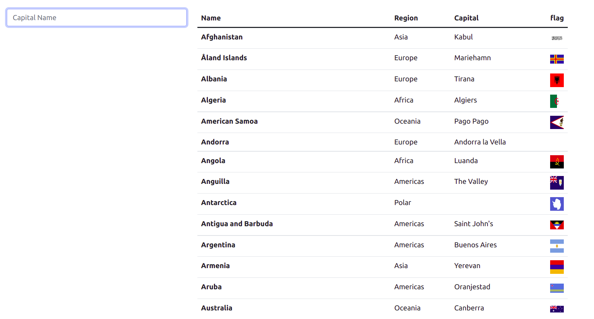
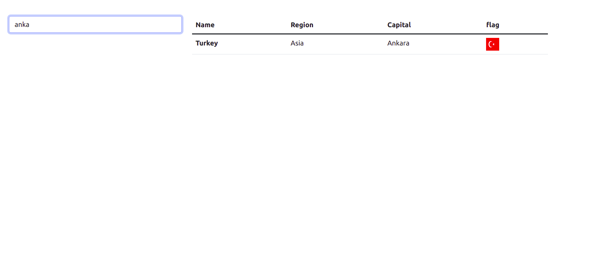

# Fintech

Npm install ile node dosyalarını yükleyin.

ng serve ile projeyi çalıştırabilirisiniz.

Uygulama ilk çalıştığında tüm ülkelerin bilgilerini getirir.

Yazdıkça aranan kelimeyle eşleşen ülkeleri döndürür.

